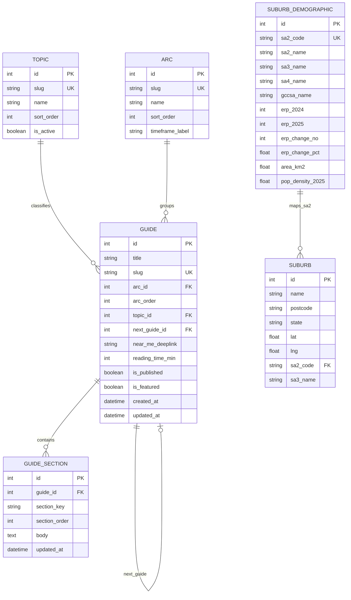

# Minuri Iteration 2 ERD (Simplified)

This version is intentionally lean for your current backend, but includes small lookup tables for consistency:

- Keep stable reference/content data in the database.
- Keep live places data from API calls (do not persist yet).
- Keep personal journey state in localStorage (not server DB).

## MVP+ ERD (Mermaid)

## What to Populate Now (Database)

### 1) Taxonomy lookups (small but important)

Populate once and rarely change:

- `topics` (5 rows):
  - `food_eating` - Food & Eating
  - `getting_around` - Getting Around
  - `health_wellbeing` - Health & Wellbeing
  - `home_admin` - Home & Admin
  - `social_belonging` - Social & Belonging
- `arcs` (3 rows):
  - `week_one` - You Just Moved In
  - `month_one` - Getting Set Up
  - `month_three` - Finding Your Rhythm

### 2) Guide metadata (`guides`)

For each of the 15 guides, populate:

- Core fields:
  - `title`
  - `slug`
  - `reading_time_min`
  - `is_published`
  - `is_featured`
- New Iteration 2 fields:
  - `arc_id` (FK to `arcs`)
  - `arc_order` (1-5)
  - `topic_id` (FK to `topics`)
  - `next_guide_id` (nullable for last guide in arc)
  - `near_me_deeplink` (e.g. `/near-me?topic=health-wellbeing&from=finding-a-gp-before-you-need-one`)

### 3) Guide body content (`guide_sections`)

Store content in normalized sections instead of one large `content` field.

For each guide, create rows for:

- `section_key = moment`, `section_order = 1`
- `section_key = feeling`, `section_order = 2`
- `section_key = reveal`, `section_order = 3`
- `section_key = how_it_works`, `section_order = 4`
- `section_key = bridge`, `section_order = 5`
- `section_key = next_chapter`, `section_order = 6`

Each row stores the text in `body`.

### 4) Suburbs (`suburbs`)

Populate/maintain:

- `name`
- `postcode`
- `state`
- `lat`
- `lng`
- `sa2_code`
- `sa3_name`

### 5) Population (`suburb_demographics`) if live stats remains in scope

Populate/maintain:

- `sa2_code`, `sa2_name`, `sa3_name`, `sa4_name`, `gccsa_name`
- `erp_2024`, `erp_2025`
- `erp_change_no`, `erp_change_pct`
- `area_km2`, `pop_density_2025`

## What Not to Store Yet

Do not create DB tables for these in Iteration 2:

- `user_journey`
- `guide_progress`
- `arc_progress`
- `saved_location`
- `location` cache from Near Me APIs

Use localStorage for personal state and API responses for Near Me.

## Suggested Seeding Order

1. `topics`, `arcs`
2. `suburbs` and `suburb_demographics` loaders
3. `guides` (15 guide metadata rows)
4. `guide_sections` (6 rows per guide, total 90 rows)
5. Personal journey state handled client-side via localStorage
