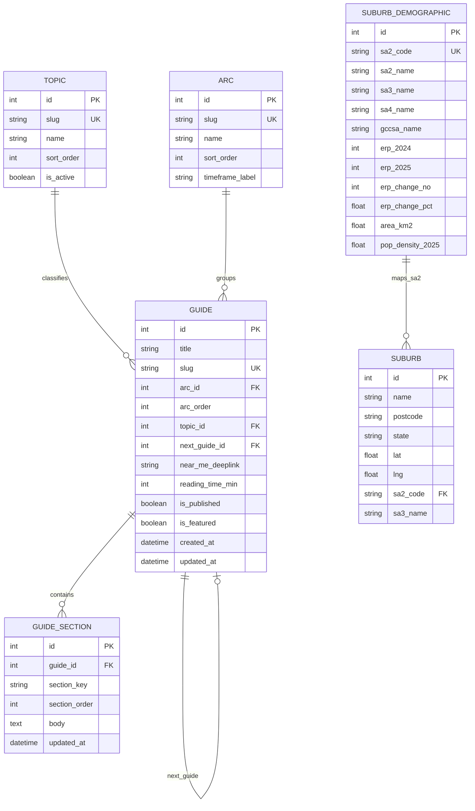

# Minuri Server

<div align="center">
  
</div>
<br/>
<p align="center">
<a href=""></a> <br>
<a href=""></a>
<a href=""></a>
<a href=""></a> <br>
<a href=""></a>
<a href=""></a>
<a href=""></a>
</p>

Minuri Server is the backend service for Minuri. It is built with FastAPI and currently powers APIs for location-based discovery and supporting data. The backend is expected to evolve over time, so this README is intentionally focused on local development and the current shape of the project.

## Table of Contents

- [Getting Started](#getting-started)
- [Local Development](#local-development)
- [Environment Variables](#environment-variables)
- [Data Sources and Import](#data-sources-and-import)
- [Data Flow](#data-flow)
- [Project Structure](#project-structure)
- [Current API Overview](#current-api-overview)
- [Notes](#notes)

## Getting Started

```bash
cd minuri-server
uv sync
```

Create a local `.env` file in the project root:

```env
SERPAPI_API_KEY=your_key_here
```

Start the development server:

```bash
uv run uvicorn app.main:app --reload
```

## Local Development

- Server URL: `http://127.0.0.1:8000`
- API docs: `http://127.0.0.1:8000/docs`
- Root endpoint: `http://127.0.0.1:8000/`

## Environment Variables

- `SERPAPI_API_KEY`: API key used for nearby-interest search

Keep secrets in your local `.env` file and do not commit them to source control.

## Data Sources and Import

This project currently uses three main external data sources: one for suburb master data, one for official population statistics, and one live API source for nearby places.

### 1) Australian Postcodes (suburb master data)

Source:
- Repository: [https://github.com/matthewproctor/australianpostcodes](https://github.com/matthewproctor/australianpostcodes)
- CSV used by the loader: [https://raw.githubusercontent.com/matthewproctor/australianpostcodes/master/australian_postcodes.csv](https://raw.githubusercontent.com/matthewproctor/australianpostcodes/master/australian_postcodes.csv)

What it is:
- A structured postcode/locality dataset for Australia.

What it contains (used fields):
- Locality name, postcode, state
- Latitude/longitude
- SA2 code and SA3 name metadata

How we use it:
- `app.scripts.load_melbourne_suburbs` fetches the CSV, filters to Victoria suburbs in Greater Melbourne (`sa4` 206-214), and writes records into the `suburbs` table.
- `GET /suburb` and `GET /suburb/larger-region` read from this imported data.

Load command:
```bash
uv run python -m app.scripts.load_melbourne_suburbs
```

### 2) ABS Regional Population (Victoria)

Source:
- ABS Regional Population release (Table 2): [https://www.abs.gov.au/statistics/people/population/regional-population/2024-25#data-downloads](https://www.abs.gov.au/statistics/people/population/regional-population/2024-25#data-downloads)

What it is:
- Official Australian Bureau of Statistics regional population dataset.

What it contains (used fields):
- SA2/SA3/SA4/GCCSA names and codes
- ERP population values (2024 and 2025)
- Growth and density measures (change %, area, density)

How we use it:
- `app.scripts.extract` converts the ABS Excel table into `app/data/victoria_population_table.csv`.
- `app.scripts.load_population_records` loads the CSV into `suburb_demographics`.
- `GET /api/population` aggregates `erp_2025` values by matching the requested location against SA2/SA3/SA4/GCCSA names.

Load commands:
```bash
uv run python -m app.scripts.extract
uv run python -m app.scripts.load_population_records
```

### 3) SerpApi (live nearby-interest search)

Source:
- SerpApi Google Local results API: [https://serpapi.com/](https://serpapi.com/)

What it is:
- A live third-party search API used at request time.

What it contains:
- Nearby place results from Google Local (for example, names, ratings, addresses, and related listing metadata).

How we use it:
- `app.services.near_me` calls SerpApi using `SERPAPI_API_KEY`.
- `GET /api/nearby-interest` returns live results directly from SerpApi (this flow does not persist data in the project database).

## Data Flow

The diagram below shows the current import pipeline and runtime API flow.

```mermaid
flowchart TD
    A1[Australian Postcodes CSV<br/>GitHub source] --> S3[load_melbourne_suburbs.py]
    A2[ABS Victoria Population XLSX] --> S1[extract.py]
    S1 --> F1[app/data/victoria_population_table.csv]
    F1 --> S2[load_population_records.py]
    S4[seed_static_reference_data.py] --> DB[(Postgres (Neon DB))]
    S3 --> DB
    S2 --> DB

    RUN[python -m app.scripts] --> S1
    RUN --> S2
    RUN --> S3
    RUN --> S4

    DB --> SV1[suburb_service.py]
    DB --> SV2[population_service.py]
    A3[SerpApi<br/>Google Local Search] --> SV3[near_me.py]
    SV1 --> API[FastAPI app]
    SV2 --> API
    SV3 --> API

    API --> R1[GET /suburb]
    API --> R2[GET /suburb/larger-region]
    API --> R3[GET /api/population]
    API --> R4[GET /api/nearby-interest]
    R1 --> U[Client / Frontend]
    R2 --> U
    R3 --> U
    R4 --> U

    classDef source fill:#e3f2fd,stroke:#1e88e5,color:#0d47a1;
    classDef etl fill:#ede7f6,stroke:#5e35b1,color:#311b92;
    classDef db fill:#e8f5e9,stroke:#2e7d32,color:#1b5e20;
    classDef serve fill:#fff3e0,stroke:#ef6c00,color:#e65100;
    classDef client fill:#fce4ec,stroke:#c2185b,color:#880e4f;
    classDef runner fill:#f3e5f5,stroke:#8e24aa,color:#4a148c;

    class A1,A2,A3,F1 source;
    class S1,S2,S3,S4 etl;
    class DB db;
    class SV1,SV2,SV3,R1,R2,R3,R4,API serve;
    class U client;
    class RUN runner;
```

### ERD



## Project Structure

- `app/main.py` - FastAPI application setup
- `app/routers/` - API route definitions
- `app/services/` - business logic and third-party data access
- `app/config.py` - settings and environment loading

## Current API Overview

- `GET /`
- `GET /api/nearby-interest`
- `GET /api/population`
- `GET /suburb`
- `GET /suburb/larger-region`

These routes reflect the current backend surface and may change as the project grows.

### Suburb Endpoints

- `GET /suburb`
  - Query params:
    - `limit` (optional, default `100`, min `1`, max `1000`)
    - `larger_region` (optional SA3 name filter)
  - Response:
    - `{ "suburbs": [{ "locality", "postcode", "state", "long", "lat", "larger_region" }] }`
- `GET /suburb/larger-region`
  - Returns all distinct SA3 names from suburb records.
  - Response:
    - `{ "larger_regions": ["Bayside", "Melbourne City", "..."] }`

## Notes

- This backend is still early-stage and expected to evolve.
- Some endpoints depend on third-party APIs and external data sources.
- Frontend and backend integration details may shift as Minuri expands.
